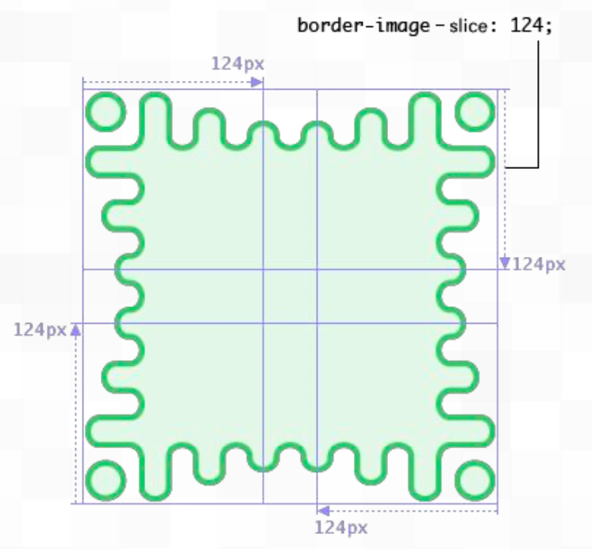
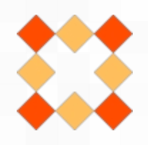

# CSS3 边框图片效果

本章主要探讨 HTML5 中 CSS3 中边框图片背景的效果，通过这个新属性让边框更加的丰富多彩。

## 一.属性解释

CSS3 提供了一个新的属性集合，用这几个属性可以嵌入图片形式的边框。这样，边框就可以自定义了。

<table>
<tr>
    <td>border-image-source</td>
    <td>引入背景图片地址</td>
</tr>
<tr>
    <td>border-image-slice</td>
    <td>切割引入背景图片</td>
</tr>
<tr>
    <td>border-image-width</td>
    <td>边框图片的宽度</td>
</tr>
<tr>
    <td>border-image-repeat</td>
    <td>边框背景图片的排列方式</td>
</tr>
<tr>
    <td>border-image-outset</td>
    <td>边框背景向外扩张</td>
</tr>
<tr>
    <td>border-image</td>
    <td>上面五个属性的简写方式</td>
</tr>
</table>

## 二.属性解释

要实现边框背景，我们对图片也有一定的要求，否则效果不能完全体现出来。图片可以 通过九宫格的切分来了解它。我们使用 W3C 官网上教学的图片来讲解一下。



如上图所示，九宫格并不一定要求每一个格子大小都相同。当然，如果相同的话，制作 边框背景就相对容易一点。比如如下这张图片:



首先，用 Photoshop 软件分析一下这个标准九宫格的总体大小和每个格子的大小。最终得出图片总大小为 81px 正方形，四个角的大小为 27px 的正方形，其余五个角也是 27px。

那么，第一步:先创建一个盒子区域，大小为 400x400 的矩形。然后设置引入边框图像。

```css
//引入边框图像
border-image-source: url(border.png);
```

单单只有这句话，webkit 引擎下的浏览器会在盒子区块的四个角看到一丁点图像的影 子。而其他浏览器什么都看不到。这是由于没有设置边框背景图像的宽度导致的。

```css
//设置边框图像宽度，上右下左，可以设置四个值 
border-image-width: 81px;
```

这里设置的是边框图像的宽度，而不是边框宽度。当你设置边框宽度，你会发现，文本 会偏移。而边框图像的宽度不会挤压文本。

```css
//设置边框的宽度 
border-width: 20px;
```

以上设置完毕后，支持边框背景图片的浏览器会在四个角落铺上这张图片的完整形式。 这个时候需要通过引入切割属性来配置背景图片的显示方式。

```css
//首先，边框图像宽度设置为 27px 和一个单格宽高一致 
border-image-width: 27px;
//设置切割属性的大小
border-image-slice: 27;
```

这里的 27 不需要设置 px 像素，因为它默认就是像素。设置 27 之后，我们会发现边框 的四个角正好是橘红色的四个角。那么你可以逐步放大或逐步放下这个值，来体验一下它的 变化。

```css
//从 27 逐步放大到 81，四个角都慢慢缩小，各自显示一个完整的图像 
border-image-slice: 81;

//从 27 逐步缩小到 0，发现四个角都慢慢变大，配合 fill 整体显示一个完整图像 border-image-slice: 0 fill;
```

上面只是单独设置了一个像素表示四个边切割的大小，你也可以设置百分比、浮点值或 者分别设置四个变的大小。

```css
//33.5%差不多 27 
border-image-slice: 33.5%;

//上下设置 27，左右设置 0 
border-image-slice: 27 0;

//如果想让边框背景向外扩张，那么可以进行扩张设置。 
//向外扩张 20px，也可以是浮点值，比如 2.2 
border-image-outset: 20px;
```

四个角设定好之后，我们要设定四个变的显示排列方式。使用 border-image-repeat 属性，有四个值提供使用，分别如下表:

| 属性 | 说明 |
| -- | -- |
| stretch | 指定用拉伸方式填充边框背景图。默认值。 |
| repeat | 指定用平铺方式来填充边框背景图。当图片碰到边界时，如果超 过则被截断。 |
| round | 指定用平铺方式来填充边框背景图。图片会根据边框的尺寸动态 调整图片的大小，直至正好可以铺满整个边框。 |
| space | 指定用平铺方式来填充边框背景图。图片会根据边框的尺寸动态 调整图片的之间的间距，直至正好可以铺满整个边框。 |

```css
//拉伸方式填充，当然，通过上右下左设置四个边均可 
border-image-repeat: stretch;

//平铺填充，超过则被截断 
border-image-repeat: repeat;

//平铺填充，动态调整图片大小直至铺满 
border-image-repeat: round;

//平铺填充，动态调整图片的间距直至铺满 
border-image-repeat: space;

//另一个按钮的小例子 div {
    width: 400px;
    height: 40px;
    border-image-source: url(button.png); 
    border-image-width: 10px; 
    border-image-slice: 10 fill; 
    border-image-repeat: stretch;
}
```

## 三.简写和版本

//border-image 简写格式很简单，具体如下:

```
border-image:<' border-image-source '> || <' border-image-slice '> [ /
<' border-image-width '> | / <' border-image-width '>? / <' border-image-outset '> ]? || <' border-image-repeat '>
```

```css
//以上是手册上摘录的，转换成实际格式如下: 
border-image: url(border.png) 27/27px round;
```

对于支持的浏览器及版本如下表:

|  | Opera | Firefox | Chrome | Safari | IE |
| -- | -- | -- | -- | -- | -- |
| 部分支持需带前缀 | 11.5~12.1 | 3.5 ~ 14 | 4 ~ 14 | 3.1 ~ 5.1 | 无 |
| 支持需带前缀 | 无 | 无 | 无 | 无 | 无 |
| 支持不带前缀 | 15+ | 15+ | 15+ | 6+ | 11.0+ |

```css
//兼容加上前缀
-webkit-border-image: url(border.png) 27/27px round;
-moz-border-image: url(border.png) 27/27px round; 
-o-border-image: url(border.png) 27/27px round; 
border-image: url(border.png) 27/27px round;
```


