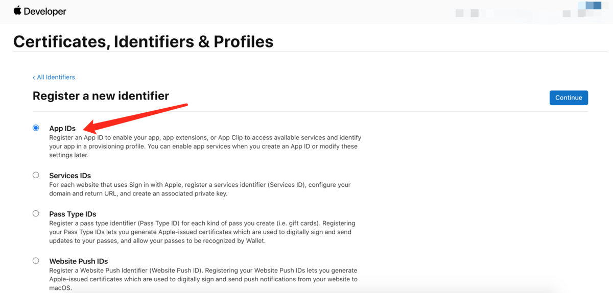
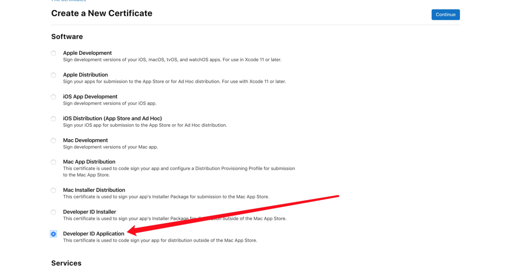

# Mac安装包签名/公正

## 证书

### 创建App IDs



### 创建证书

在苹果开发者网站创建**developer id application**证书，并生成**p12**证书



### 设置环境变量

将**p12**证书放到一个位置，编辑`~/.zshrc`文件

```shell
export CSC_LINK=/Users/mac/Documents/developer_id_application.p12
export CSC_KEY_PASSWORD=123456
```

执行`source ~/.zshrc`

## 签名

编辑**package.json**文件，此处的`appId`要与前面创建的**App ID**相同

```json
...
"build": {
	...
	"appId": "com.electron.app",
	...
}
...
```

## 公正

[参考文档](https://developer.apple.com/documentation/security/notarizing_macos_software_before_distribution/customizing_the_notarization_workflow)

### 创建profile

```shell
# 打开钥匙串
# PASSWORD是用户登陆密码
security unlock -pPASSWORD ~/Library/Keychains/login.keychain-db

# 生成profile
xcrun notarytool store-credentials "AC_PASSWORD" --apple-id "AC_USERNAME" --team-id <WWDRTeamID> --password <secret_2FA_password>
```

* 打开钥匙串的`PASSWORD`是当前用户密码，即开机密码
* `AC_PASSWORD`是profile的名称，例如：`com.electron.package`
* `AC_USERNAME`开发者账户id
* `WWDRTeamID`开发者账户team id
* `password`应用专用密码

### 公正

```shell
xcrun notarytool submit OvernightTextEditor_11.6.8.zip --keychain-profile "AC_PASSWORD" --wait
```

* `AC_PASSWORD`即前面创建的**profile**文件名称

正确的结果：`status`为`Accepted`。

```
Conducting pre-submission checks for electron-demo-1.0.14-arm64.dmg and initiating connection to the Apple notary service...
Submission ID received
  id: 1afe8d4a-4329-4f68-bd4f-62f5cea75ecf
Successfully uploaded file
  id: 1afe8d4a-4329-4f68-bd4f-62f5cea75ecf  path: /Users/mac/Documents/ZMAS/workspace/workspace/electron-demo-0001/test-electron/build/electron-demo-1.0.14-arm64.dmg
Waiting for processing to complete.
Current status: In Progress...
Current status: In Progress....
Current status: In Progress.....
Current status: In Progress......
Current status: In Progress.......
Current status: In Progress........
Current status: In Progress.........
Current status: In Progress..........
Current status: In Progress...........
Current status: In Progress............
Current status: Accepted.............Processing complete  id: 1afe8d4a-4329-4f68-bd4f-62f5cea75ecf  status: Accepted
```

如果为`Invalid`则公正失败，公正失败可获取log查询失败原因。首先查询历史记录：

```shell
xcrun notarytool history --keychain-profile "AC_PASSWORD"
```

结果实例：

```
Successfully received submission history. 
history 
-------------------------------------------------- 
createdDate: 2021-04-29T01:38:09.498Z 
id: 2efe2717-52ef-43a5-96dc-0797e4ca1041 
name: OvernightTextEditor_11.6.8.zip 
status: Accepted 
-------------------------------------------------- 
createdDate: 2021-04-23T17:44:54.761Z 
id: cf0c235a-dad2-4c24-96eb-c876d4cb3a2d 
name: OvernightTextEditor_11.6.7.zip 
status: Accepted 
-------------------------------------------------- 
createdDate: 2021-04-19T16:56:17.839Z 
id: 38ce81cc-0bf7-454b-91ef-3f7395bf297b 
name: OvernightTextEditor_11.6.7.zip 
status: Invalid
```

查询**log**

```shell
xcrun notarytool log 2efe2717-52ef-43a5-96dc-0797e4ca1041 --keychain-profile "AC_PASSWORD" developer_log.json
```


