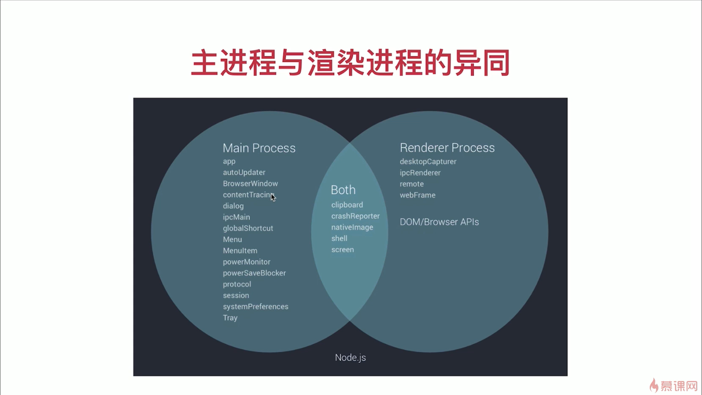
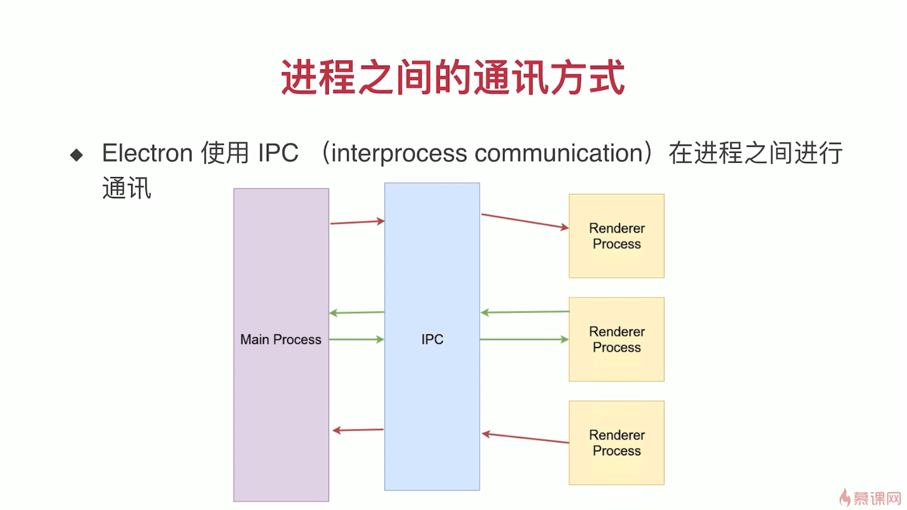

# 主线程和渲染线程

## 主线程和渲染线程



## 主线程与渲染线程通信



### IPC

**main.js**

```javascript
const { app, BrowserWindow, ipcMain } = require('electron')

function createWindow () {
	const mainWindow = new BrowserWindow({
		width: 800,
		height: 600,
		webPreferences: {
			nodeIntegration: true
		}
	})
	
	mainWindow.loadFile('index.html')
}

app.whenReady().then(() => {
	createWindow()
	app.on('activate', function () {
		if (BrowserWindow.getAllWindows().length === 0) createWindow()
	})

	// 订阅消息 渲染线程->主线程
	ipcMain.on('message', (event, arg) => {
		console.log(event)
		console.log(arg)
		// 订阅消息 主线程->渲染线程
		event.reply('reply', 'hello from main process')
	})
})

app.on('window-all-closed', function () {
	if (process.platform !== 'darwin') app.quit()
})
```

**渲染线程**

```javascript
const { ipcRenderer } = require('electron')

window.addEventListener('DOMContentLoaded', () => {
	// 发送消息 渲染线程->主线程
	document.getElementById('send').addEventListener('click', () => {
		ipcRenderer.send('message', 'hello from renderer')
	})
	// 订阅消息 主线程->渲染线程
	ipcRenderer.on('reply', (event, arg) => {
		document.getElementById('message').innerHTML = arg
	})
})
```

### remote

```javascript
const { BrowserWindow } = require('electron').remote

window.addEventListener('DOMContentLoaded', () => {
	document.getElementById('node-version').innerHTML = {
		let win = new BrowserWindow({ width: 800, height: 600 })
		win.loadURL('https://baidu.com')
	}
})
```

