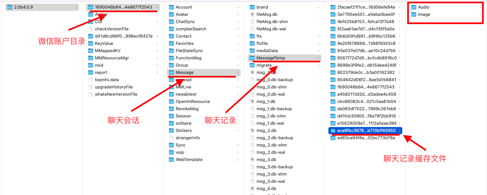

# mac qq 语音处理

## mac qq语音缓存目录

```shell
~/Library/Containers/com.tencent.qq/Data/Library/Caches/PTT
```

## silk转mp3

使用第三方工具**silk-v3-decoder**转换**silk**为**mp3**。

- 文件：[文件地址](../assets/file/mac/silk-v3-decoder-master.zip)
- 源码地址：[GitHub源码地址](https://github.com/kn007/silk-v3-decoder)

[[silk-v3-decoder|使用方法]]

## 将多个mp3文件合并

```shell
cat ca0a9993803fb2239e53b1d4ed7b2d8f.mp3 >> file.mp3
```

# mac 微信语音处理

## mac微信文件缓存目录

```
~/Library/Containers/com.tencent.xinWeChat/Data/Library/Application\ Support/com.tencent.xinWeChat/2.0b4.0.9
```




