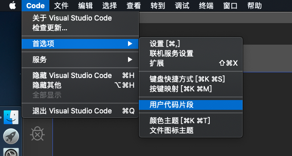
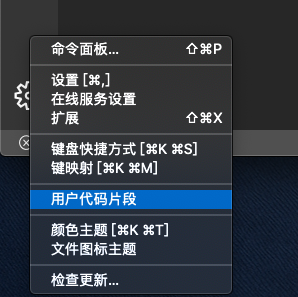
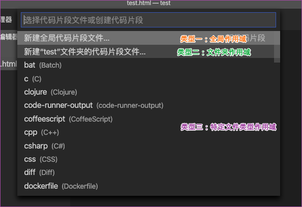
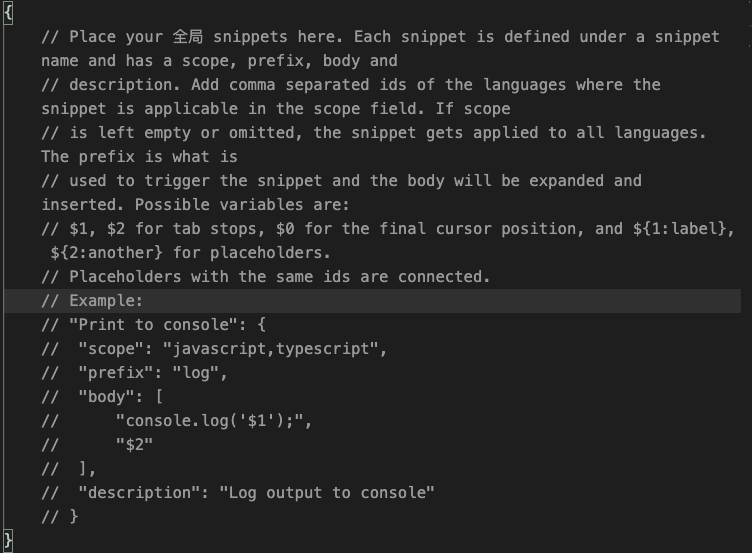
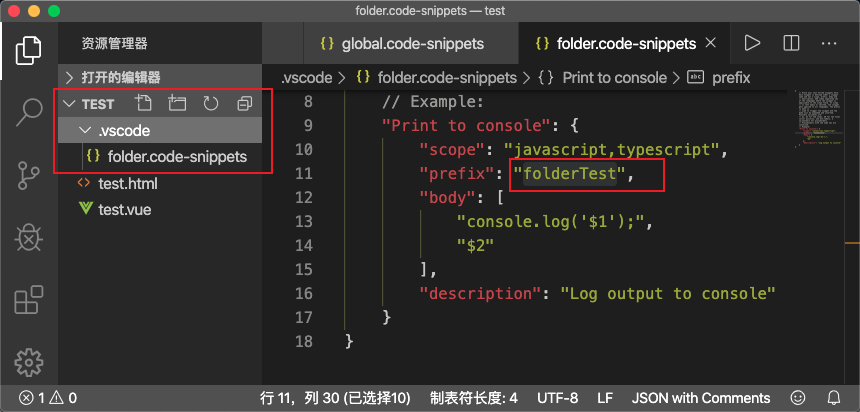
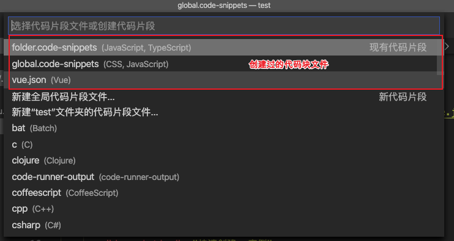
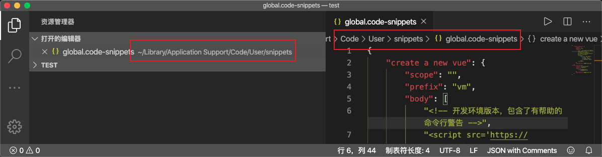

# VSCode

## 自定义代码片段

### 第一步：打开书写代码块的工作区间（两种方法）

点击Code-首选项-用户代码片段



点击管理(左下角小齿轮)-用户代码片段



### 第二步：选择代码块作用域的文件类型



- 类型一：`全局作用域`

这种类型的代码块是创建在vscode软件内部的文件。是跟随这当前安装的vscode这个软件的，不会随着项目的关闭而失效，会一直存在。

- 类型二：`文件夹作用域`

这种类型的代码块是创建在某个文件下.vscode这个隐藏文件夹中的，这个代码块只适用于当前文件夹，出了这个文件夹就不能使用这个代码块了

- 类型三：`特定文件类型作用域`

这种类型的代码块跟全局作用域的文件路径是一致的，都是创建在了vscode中，会一直存在。但是这种代码块只适合于你指定的文件类型。比如：如果你创建的是JavaScript类型，那这个代码块就不能再vue文件中使用。
注意三种类型的代码块书写规范都是一致的

### 第三步：代码块的书写

我们选择一种类型（我这里选择全局作用域类型），并且给这个文件起一个名字，  

ps:名字随便起，我这里就叫global



我们需要在这对大括号中书写我们的代码块，这里系统给了我们一个例子Example下方就是一个例子。下方是我自己书写的一个代码块

```json
{
"create a new vue": {
        "scope": "",  
		"prefix": "vm",
		"body": [
			"<!-- 开发环境版本，包含了有帮助的命令行警告 -->",
			"<script src='https://cdn.jsdelivr.net/npm/vue/dist/vue.js '></script>",
			"<script>",
				"    var vm = new Vue({",
				"        el: '$1',",     //使用空格缩进，不能使用tab键缩进
				"\t\tdata: {$2},",      //我们也可以使用\t缩进
				"\t\tmethods: {$3}",
				"\t})",
			"</script>",
		],
		"description": "快速创建vm实例"
	},
"creat a new style":{  
		"scope": "css",  
		"prefix": "newStyle", 
		"body": [              
			"* {\n\tpadding:0;",  //使用\n换行 使用\t缩进
				"\tmargin:0;\n}"
		],
		"description": "关闭默认样式" 
	}
}

```

所有的代码段都必须写在最外层大括号中，每个代码块之间用逗号隔开，一个代码块就类似一个对象。上方代码就是简单写了两个代码块。 接下来介绍每个属性的作用及方法。

- `scope`：作用文件类型。就是代码块的作用文件类型，这里我们可以指定文件类型，多种类型之间用逗号隔开，比如如果指定作用范围类型"css, javascript" 那么这个代码块只能在这两种类型的文件中起作用。如果值为空，或者是不写这个属性，默认所有类型文件都支持改代码块。在特定文件类型中这个值是不起作用的，写了会报错，因为这种类型已经本身已经限制了文件类型
- `prefix`： 触发代码块的字符串。写代码的时候我们只需敲出这个字符串就会触发我们的代码块。
- `body`：代码块的主体内容。我们需要把我们的代码书写在这个属性中。仔细观察我们可以看出，代码块主体就是字符串的数组。
- `description`：代码块的简单介绍，我们可以介绍一下这段代码块是干什么用的
代码主体的书写规范：

每个字符串元素就代表一行，行与行之间用 , (逗号)隔开表示换行。或者使用`\n`换行
行内不能使用tab键缩进，只能使用空格或者`\t`缩进
`$1`使用代码块敲击回车或者tab键后光标定位的位置。`$2 $3 $4...`表示我们按下tab光标依次出现的位置

### 第四步：代码块的使用

使用代码块的方式非常简单，我们只需在想要书写的位置敲出触发我们代码块的关键字就行  

**全局作用域的代码块：**


上图我们可以看到，vm这个代码块，我这是的是全局的也没有限制作用文件类型，所以这个代码块全局都能使用。但是`newstyle`这个代码块虽然也是全局的，但是我这边限制的文件类型只能在css中，所以这个代码块只能在style标签中使用，不能在body标签中使用  

**文件夹作用域的代码块：**



当我们创建文件夹代码块的时候，我们代码块文件会被创建在TEST文件夹的.cscode文件夹下，这个代码块文件会只作用于TEST这个文件夹下的所有文件。如果在打开其他文件夹或者项目，那么这个代码块将不存在。  

**指定文件类型代码块**


上图我事先创建了vue.json文件，并创建了`testVue`代码块，这个代码块指定了只能使用在vue文件中，所以在test.html中我们没有`testVue`代码块，在test.vue中就能提醒有testVue代码块。

### 第五步：代码块的编辑与删除

**编辑**：如果我们想要编辑我们的代码块，我们就需要找到这个文件，然后才能编辑代码块内容。我们如何找到这个文件呢，步骤如同第一步



我们可以看到所有我们之前创建过的文件，我们找到对应的文件，打开并修改然后保存就可以了。  
**删除**：如果不想使用某个代码块，我们只需找到这个代码块的书写位置，然后把它删掉就好了。但是我们如何删除代码块文件呢。首先我们需要找到的路径。



通过这两种方式找到文件，然后我们可以重命名或者删除这个文件就行了  

**注意：全局类型和特定文件类型的代码块文件都是保存在这个路径下的，文件夹代码块文件是保存在.vscode中的（第四步提到过）**

## Mac快速操作

在Mac系统上，选中一个目录，右键菜单并没有“通过Code打开”这个操作，不过我们可以通过Automator自己添加这个操作。

打开Mac自带的app“自动操作（Automator）”，选择“快速操作”：


保存为“使用VSCode打开”即可。

修改图标，图标需要icns格式图标，可以在线转换，替换好后重启电脑就会生效。

