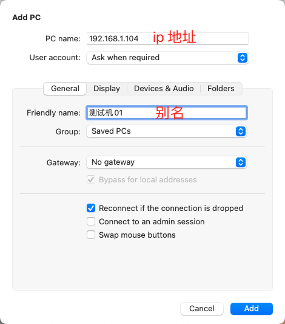

# 远程链接windows桌面

## Microsoft Remote Desktop

### 下载工具

微软官方提供的远程连接工具 [Microsoft Remote Desktop](https://links.jianshu.com/go?to=https%3A%2F%2Fdocs.microsoft.com%2Fen-us%2Fwindows-server%2Fremote%2Fremote-desktop-services%2Fclients%2Fremote-desktop-mac)

### 安装使用

## TeamViewer

[TeamViewer官网](https://www.teamviewer.cn/cn/?utm_source=baidu&utm_medium=cpc&utm_campaign=CN%7CB%7CPR%7C20%7Cnov%7Cbrand-words%7Cnew%7Ct0%7C0&bd_vid=10962328688079507871)