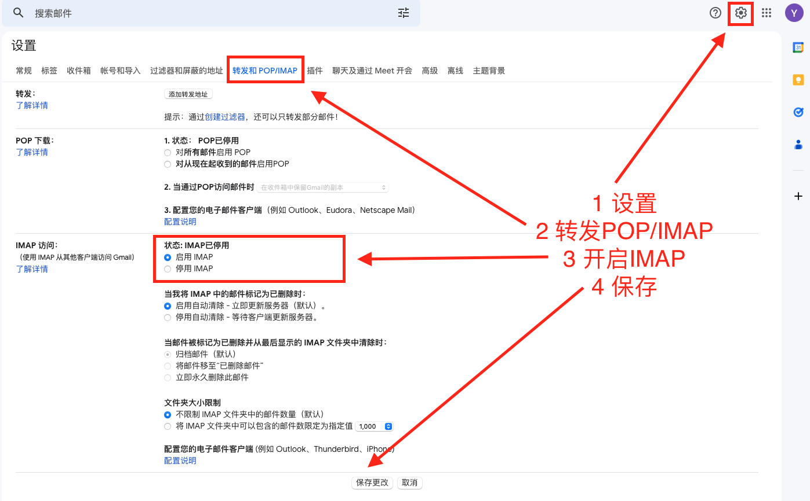

# 邮件

## 安装

```shell
npm install nodemailer --save
```

## 邮箱授权

进入`邮箱 > 设置 > 账户 > POP3/IMAP/SMTP/Exchange/CardDAV/CalDAV`服务  
开启`POP3/SMYP`服务，获取授权码

## 配置config

在`config.default.js`中写入以下配置

```json
config.email = { 
	host: 'smtp.163.com', //邮件host 
	name: 'xxx@163.com', // 邮件名 
	password: 'ECGWYISCQNBSYDMW',  // vcamessage@163.com Vca123456 ,授权码登录 
	to:'184336166@qq.com,xxx@163.com'//发送给谁 
};
```

## 封装

在位置 `/service/utils/emailUtil` 进行封装

```js
'use strict';

const Service = require('egg').Service;
const nodemailer = require('nodemailer');

class EmailUtilService extends Service {
  
  async sendMail(phone, subject,text) { //nodemailer方式

    const transport = nodemailer.createTransport({
      host: this.config.email.host,
      // secureConnection: true, // use SSL
      port: 465,
      secure: true,
      auth: {
        user: this.config.email.name,
        pass: this.config.email.password
      }
    });
    
    const message = {
      from: this.config.email.name, // Sender address
      to: this.config.email.to,         // List of recipients
      subject: subject, // Subject line
      html: `用户账号：${text.phone}<br>用户昵称：${text.nick_name}<br>联系方式：${text.contact}<br>反馈信息：${text.feedback}<br>反馈时间：${this.ctx.helper.formatTime()}` // Plain text body
    };
    
    console.log('message:', message);
    // console.log('transport:', transport);
    transport.sendMail(message, function (err, info) {
      if (err) {
        console.log('err:');
        console.log(err);
      } else {
        console.log(info);
      }
    });
  }
}

module.exports = EmailUtilService;
```

## 使用

在`container`中调用`service`的`utils`方法即可

```js
const sendEmailawRes = await 

ctx.service.utils.emailUtil.sendMail(params.contact,'用户问题反馈('+ params.phone + ')',params);
if(sendEmailawRes){
	ctx.body={
    message: '发送成功',
    code:0
  };
}else{
	ctx.body={
    message: '发送失败',
    code:-1
  };
}
```

## 网易邮箱

### 1 设置开启SMTP

### 2 新增授权码


### 3 配置

```js
config.email = {
	host: 'smtp.163.com', //邮件host
	name: 'xxxx@163.com', // 邮件名
	password: 'xxxxxxx', // 授权码
}
```

## 谷歌邮箱

### 1 开启两步验证

### 2 设置应用专用密码


### 3 设置SMTP



### 4设置

```js
config.email = {
	host: 'smtp.gmail.com', //邮件host
	name: 'xxxx@gmail.com', // 邮件名
	password: 'xxxxxx', // 应用专属密码
}
```

