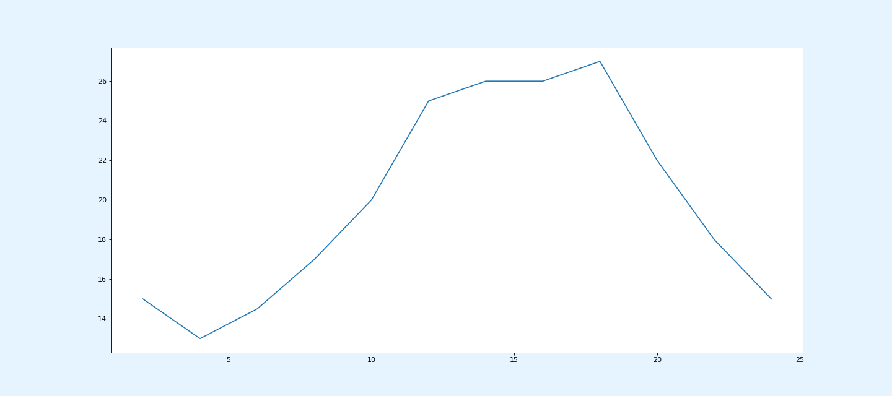

# matplotlib基本使用

## 基本使用

```python
from matplotlib import pyplot as plt

# XY轴数据
x = range(2,26,2)
y = [15,13,14.5,17,20,25,26,26,27,22,18,15]

# 设置标题
plt.title("Image Title")

# 绘图
plt.plot(x, y)

# 展示
plt.show()
```


###  保存图像

```python
plt.savefig('./matplotlib.png')
```

### 设置“画布”

```python
figure(num=None, figsize=None, dpi=None, facecolor=None, edgecolor=None, frameon=True)
```

- num:图像编号或名称，数字为编号 ，字符串为名称
- figsize:指定figure的宽和高，单位为英寸；
- dpi参数指定绘图对象的分辨率，即每英寸多少个像素，缺省值为80
- facecolor:背景颜色
- edgecolor:边框颜色
- frameon:是否显示边框

```python
plt.figure(num='Test', figsize=(18,8), dpi=80, facecolor='#e6f4ff')
```



### 坐标

```python
from matplotlib import pyplot as plt
import random

x = range(0,120)
y = [random.randint(20,35) for i in range(120)]
plt.figure(figsize=(20,8),dpi=80)
plt.plot(x,y)

_xtick_labels = ["10:{}".format(i) for i in range(60)]
_xtick_labels += ["11:{}".format(i) for i in range(60)]

# 坐标刻度
plt.xticks(list(x)[::10],_xtick_labels[::10],rotation=45)

# XY轴坐标标题
plt.xlabel("Time")
plt.ylabel("temperature(℃)")

plt.show()
```

`xticks`坐标刻度参数：

- 参数1: 坐标位置列表
- 参数2:坐标的名称
- rotation: 旋转角度

> 同理：`yticks`


### 图例 & 多条折线

```python
from matplotlib import pyplot as plt
import random

x = range(0,10)
y1 = [random.randint(20,35) for i in range(10)]
y2 = [random.randint(20,35) for i in range(10)]

# 绘制多条折线
# label：线名称
# color：线条颜色
# linestyle: 线条样式
plt.plot(x, y1, label='Line1', color="#f5222d")
plt.plot(x, y2, label='Line2', color="#52c41a", linestyle="--")

# 显示图例
# loc：图例位置
plt.legend(loc="upper left")

_xtick_labels = ["10:{}".format(i) for i in range(10)]
plt.xticks(list(x)[::2],_xtick_labels[::2],rotation=45)
plt.xlabel("Time")
plt.ylabel("temperature(℃)")
plt.show()
```


### 设置中文

```python
from matplotlib import pyplot as plt
from matplotlib import font_manager
import random

# 获取系统字体
my_font = font_manager.FontProperties(fname="/System/Library/Fonts/PingFang.ttc")

x = range(0,10)
y1 = [random.randint(20,35) for i in range(10)]
y2 = [random.randint(20,35) for i in range(10)]

plt.plot(x, y1, label='线1', color="#f5222d")
plt.plot(x, y2, label='线2', color="#52c41a")

_xtick_labels = ["10时{}分".format(i) for i in range(10)]

# 设置坐标刻度中文
plt.xticks(list(x)[::2],_xtick_labels[::2],rotation=45, fontproperties=my_font)

# 设置坐标轴名称中文
plt.xlabel("时间", fontproperties=my_font)
plt.ylabel("温度 单位(℃)", fontproperties=my_font)

# 设置图表标题中文
plt.title("10点到12点每分钟的气温变化情况",fontproperties=my_font)

# 设置图例中文
plt.legend(prop=my_font, loc="upper left")

plt.show()
```


### 网格

```python
# alpha: 透明度
# linestyle: 线条形状
plt.grid(alpha=0.4, linestyle=':')
```


## 柱状图

直方图


```python

```