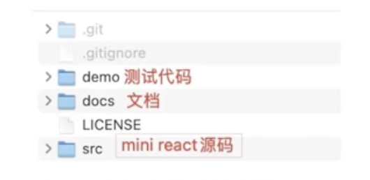
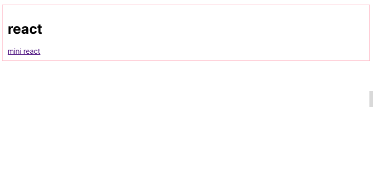

# 项目初始化

## 创建项目文件夹

首先创建mini-react的文件夹，创建

- **demo**：测试代码
- **src**：mini react源码
- **docs**：文档



## demo创建

demo下的测试代码基于vite，构建过程如下：

[如何基于Vite启动一个React项目](https://juejin.cn/post/6922701449818292232?spm=wolai.workspace.0.0.22db1778XDgxHt)

```shell
# 创建一个基于vite的名称为demo项目：
yarn create vite demo
# 1 选择React模版
# 2 选择javascript

# 进入demo目录：
cd demo

# 在demo下安装依赖：
yarn
# 启动：
yarn dev
# 浏览器端打开
```

## demo配置

在demo下建立`which-react.js`，在这里决定是引入`mini react`还是`react`，demo里的组件所需要的react api都从which-react引入。统一管理

**demo/which-react.js**

```javascript
import React, { useReducer } from "react";
import ReactDOM from "react-dom";

// import { useReducer } from "../src/react";
// import ReactDOM from "../src/react-dom";

export { ReactDOM, useReducer };
```

**demo/src/main.jsx**

```javascript
import { ReactDOM } from "../which-react";
import "./index.css";

const jsx = (
  <div className="border">
    <h1>react</h1>
    <a href="https://github.com/bubucuo/mini-react">mini react</a>
  </div>
);

ReactDOM.createRoot(document.getElementById("root")).render(jsx);
```

**index.css**

```css
body {
  margin: 0;
  font-family: -apple-system, BlinkMacSystemFont, "Segoe UI", "Roboto", "Oxygen",
    "Ubuntu", "Cantarell", "Fira Sans", "Droid Sans", "Helvetica Neue",
    sans-serif;
  -webkit-font-smoothing: antialiased;
  -moz-osx-font-smoothing: grayscale;
}

.border {
  margin: 10px;
  padding: 10px;
  border: solid pink 1px;
  font-size: 14px;
}
```

预览


