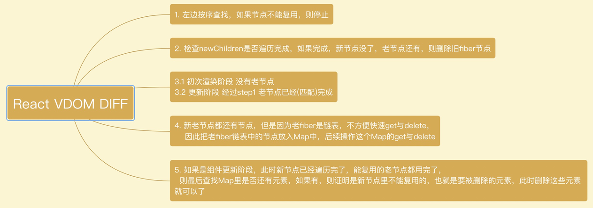

# 实现协调

## 协调



### React VDOM DIFF

- 1）左边按序查找，如果节点不能复用，则停止
- 2）检查`newChildren`是否這历完成，如果完成，新节点没了，老节点还有，则删除旧fiber节点
- 3.1）初次渲染阶段 没有老节点
- 3.2）更新阶段 经过step1 老节点已经（匹配）完成
- 4）新老节点都还有节点，但是因为老fiber是链表，不方便快速get与delete，因此把老hber链表中的节点放入Map中，后续操作这个Map的get与delete
- 5）如果是组件更新阶段，此时新节点已经遍历完了，能复用的老节点都用完了，
则最后查找Map里是否还有元素，如果有，则证明是新节点里不能复用的，也就是要被删除的元素，此时删除这些元素就可以了

```javascript
import { createFiber } from "./ReactFiber";
import { isArray, isStringOrNumber, Placement, Update } from "./utils";

// returnFiber.deletions = [a,b,c]
function deleteChild(returnFiber, childToDelete) {
  const deletions = returnFiber.deletions;
  if (deletions) {
    returnFiber.deletions.push(childToDelete);
  } else {
    returnFiber.deletions = [childToDelete];
  }
}

function deleteRemainingChildren(returnFiber, currentFirstChild) {
  let childToDelete = currentFirstChild;

  while (childToDelete) {
    deleteChild(returnFiber, childToDelete);
    childToDelete = childToDelete.sibling;
  }
}

function placeChild(
  newFiber,
  lastPlacedIndex,
  newIndex,
  shouldTrackSideEffects
) {
  newFiber.index = newIndex;
  if (!shouldTrackSideEffects) {
    // 父节点的初次渲染
    return lastPlacedIndex;
  }

  // 父节点的更新
  const current = newFiber.alternate;
  if (current) {
    // 更新
    const oldIndex = current.index;
    if (oldIndex < lastPlacedIndex) {
      // oldIndex 节点在dom上的位置
      // 新节点的位置
      // 1  3 5
      // 2
      newFiber.flags |= Placement;
      return lastPlacedIndex;
    } else {
      return oldIndex;
    }
  } else {
    // 初次渲染
    // 插入
    newFiber.flags |= Placement;
    return lastPlacedIndex;
  }
}

function mapRemainingChildren(currentFirstChild) {
  const existingChildren = new Map();
  let existingChild = currentFirstChild;
  while (existingChild) {
    existingChildren.set(
      existingChild.key || existingChild.index,
      existingChild
    );
    existingChild = existingChild.sibling;
  }

  return existingChildren;
}

// 协调（diff）
// abc
// bc

export function reconcileChildren(returnFiber, children) {
  if (isStringOrNumber(children)) {
    return;
  }

  const newChildren = isArray(children) ? children : [children];
  // oldfiber的头结点
  let oldFiber = returnFiber.alternate?.child;
  // 存储下一个oldfiber || 缓存当前的olfFiber
  let nextOldFiber = null;
  // 更新true，初次渲染是false
  let shouldTrackSideEffects = !!returnFiber.alternate;

  let previousNewFiber = null;
  let newIndex = 0;
  // 上次插入节点的位置
  let lastPlacedIndex = 0;
  // *1.从左边往右按序查找，如果节点能复用，继续往右，不能复用就停止
  for (; oldFiber && newIndex < newChildren.length; newIndex++) {
    const newChild = newChildren[newIndex];
    if (newChild == null) {
      continue;
    }
    if (oldFiber.index > newIndex) {
      nextOldFiber = oldFiber;
      oldFiber = null;
    } else {
      nextOldFiber = oldFiber.sibling;
    }
    const same = sameNode(newChild, oldFiber);

    if (!same) {
      if (oldFiber === null) {
        oldFiber = nextOldFiber;
      }
      break;
    }

    const newFiber = createFiber(newChild, returnFiber);

    Object.assign(newFiber, {
      stateNode: oldFiber.stateNode,
      alternate: oldFiber,
      flags: Update,
    });

    lastPlacedIndex = placeChild(
      newFiber,
      lastPlacedIndex,
      newIndex,
      shouldTrackSideEffects
    );

    if (previousNewFiber === null) {
      returnFiber.child = newFiber;
    } else {
      previousNewFiber.sibling = newFiber;
    }
    previousNewFiber = newFiber;
    oldFiber = nextOldFiber;
  }
  // 0 1 2 3 4
  // 0 1 2
  // *2. 如果新节点遍历完了，但是(多个)老节点还有，（多个）老节点要被删除
  if (newIndex === newChildren.length) {
    deleteRemainingChildren(returnFiber, oldFiber);
    return;
  }

  //  *3
  //   1) 初次渲染
  //   2) 老节点复用完了，但是新节点还有
  if (!oldFiber) {
    //
    for (; newIndex < newChildren.length; newIndex++) {
      const newChild = newChildren[newIndex];
      if (newChild == null) {
        continue;
      }
      const newFiber = createFiber(newChild, returnFiber);

      lastPlacedIndex = placeChild(
        newFiber,
        lastPlacedIndex,
        newIndex,
        shouldTrackSideEffects
      );

      if (previousNewFiber === null) {
        // head node
        returnFiber.child = newFiber;
      } else {
        previousNewFiber.sibling = newFiber;
      }

      previousNewFiber = newFiber;
    }

    return;
  }

  // *4. 新老节点都还有
  //  0 1 [2 3 4]
  //  0 1 [3 4]
  // Map key: value
  //  {2, }
  const existingChildren = mapRemainingChildren(oldFiber);

  for (; newIndex < newChildren.length; newIndex++) {
    const newChild = newChildren[newIndex];
    if (newChild == null) {
      continue;
    }

    const newFiber = createFiber(newChild, returnFiber);
    // 新增 | 复用
    let matchedFiber = existingChildren.get(newFiber.key || newFiber.index);

    if (matchedFiber) {
      // 节点复用
      Object.assign(newFiber, {
        stateNode: matchedFiber.stateNode,
        alternate: matchedFiber,
        flags: Update,
      });
      existingChildren.delete(newFiber.key || newFiber.index);
    }

    lastPlacedIndex = placeChild(
      newFiber,
      lastPlacedIndex,
      newIndex,
      shouldTrackSideEffects
    );

    if (previousNewFiber === null) {
      // head node
      returnFiber.child = newFiber;
    } else {
      previousNewFiber.sibling = newFiber;
    }

    previousNewFiber = newFiber;
  }

  // *5. 还剩下oldFiber
  if (shouldTrackSideEffects) {
    existingChildren.forEach((child) => deleteChild(returnFiber, child));
  }
}

// 节点复用的条件：1. 同一层级下 2. 类型相同 3. key相同
function sameNode(a, b) {
  return a && b && a.type === b.type && a.key === b.key;
}
```

## WookLoop

**ReactFiberWorkLoop.js**

```javascript
function commitWorker(wip) {
  if (!wip) {
    return;
  }

  console.log("wip", wip); //sy-log

  // 1. 提交自己
  // parentNode是父DOM节点

  const parentNode = getParentNode(wip.return); /// wip.return.stateNode;
  const { flags, stateNode } = wip;
  if (flags & Placement && stateNode) {
    // 1
    // 0 1 2 3 4
    // 2 1 3 4
    const before = getHostSibling(wip.sibling);
    insertOrAppendPlacementNode(stateNode, before, parentNode);
    // parentNode.appendChild(stateNode);
  }

  if (flags & Update && stateNode) {
    // 更新属性
    updateNode(stateNode, wip.alternate.props, wip.props);
  }

  if (wip.deletions) {
    // 删除wip的子节点
    commitDeletions(wip.deletions, stateNode || parentNode);
  }

  // 2. 提交子节点
  commitWorker(wip.child);
  // 3. 提交兄弟
  commitWorker(wip.sibling);
}

function getHostSibling(sibling) {
  while (sibling) {
    if (sibling.stateNode && !(sibling.flags & Placement)) {
      return sibling.stateNode;
    }
    sibling = sibling.sibling;
  }
  return null;
}

function insertOrAppendPlacementNode(stateNode, before, parentNode) {
  if (before) {
    parentNode.insertBefore(stateNode, before);
  } else {
    parentNode.appendChild(stateNode);
  }
}
```

