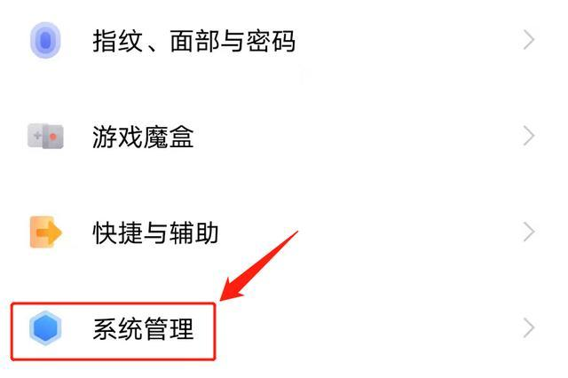
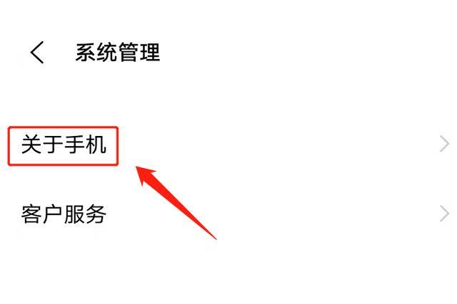
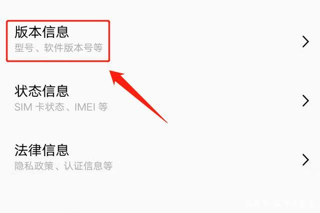
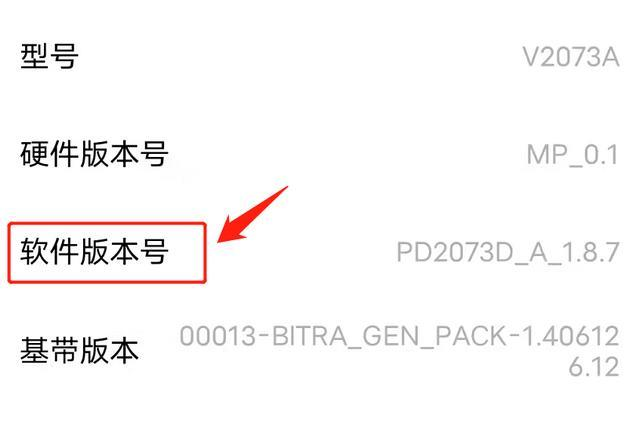
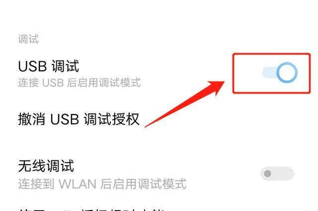

# 安卓手机开启USB调试

### 一、软件版本号

正常情况下，USB调试开关处于隐藏状态，属于手机开发者模式中的功能，如果想要打开USB调式功能，第一步要做的是找到“软件版本号”。

首先点击桌面的“齿轮状”图标，进入手机的设置界面。如下图：

进入设置界面以后，找到手机上的“系统管理”选项。如下图：

点击进入系统管理选项以后，下拉菜单找到“关于手机”选项。如下图：

点击“关于手机”选项，在弹出的菜单里找到“版本信息”选项。如下图：

点击版本信息选项，在弹出的选项里找到“软件版本号”。如下图：

### 二、开发者模式

找到“软件版本号”以后，使用手指多次触摸“软件版本号”，就会激活开发者模式，激活完成后，该界面会提示“您已处于开发者模式，无需进行此操作”。如下图：

### 三、打开开关

进行到这一步，就激活了手机的开发者模式，下一步开始寻找“USB调试”功能的开关。回到手机设置界面的主界面，下拉菜单就可以看到“系统管理”选项。如下图：

进入系统管理选项以后，下拉菜单找到“开发者选项”。如下图：

点击开发者选项，下拉菜单，找到“USB调试”选项，将后面的开关打开。如下图：

这样就可以开启手机的USB调试功能了。

注：文中演示使用的手机型号为`IQOO Z3`，手机系统版本为`Android Origin OS 1.0`，不涉及任何APP版本。