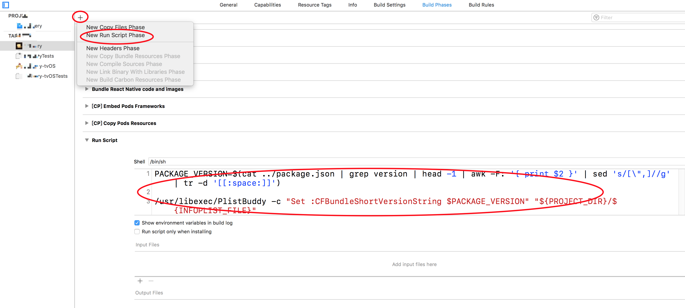

# 安卓项目

## 安卓修改包名

### 1 java文件

- `android/app/src/main/java/com/PROJECT_NAME/MainActivity.java`
- `android/app/src/main/java/com/PROJECT_NAME/MainApplication.java`

修改第一行包名

```java
package com.sprout.seiyuu;
```

1. `android/app/src/main/java/com/`目录下创建目录: `sprout`，`sprout/seiyuu`
2. 将`MainActivity.java`、`MainApplication.java`和`newarchitecture`目录移动到`seiyuu`目录下
3. 搜索`com.sprout.newarchitecture`改为`com.sprout.seiyuu.newarchitecture`
4. 搜索`com.sprout.BuildConfig`改为`com.sprout.seiyuu.BuildConfig`
5. 同理`android/app/src/debug`也创建`seiyuu`目录

### 2 安卓描述文件

修改`AndroidManifest.xml`中的包名

- `android/app/src/main/AndroidManifest.xml`

```
package="com.sprout.seiyuu"
```

### 3 打包脚本

#### 3.1 `android/app/BUCK`

修改`两个package`的值package = 'com.sprout.seiyuu'

```
android_build_config(
    ...
    package = "com.sprout.seiyuu",
)
 
android_resource(
    ...
    package = "com.sprout.seiyuu",
    ...
)
```

#### 3.2 `android/app/build.gradle`

修改`applicationId`

```
defaultConfig {
    applicationId "com.oc.objective"
    ...
}
```

修改完成后，命令行进入android目录，执行`./gradlew clean`清除缓存即可（windows上是 `gradlew.bat`）

## 修改安卓APP名称

1、找到读取app_name的地方

进入：`android/app/src/main/AndroidManifest.xml`

找到 `android:label="@string/app_name"`。这个对应的就是APP的名称。

`@string`类似于定义好的变量，直接调取即可。

2、进入：`android/app/src/main/res/valuse/strings.xml`目录下，修改即可

```xml
<resources>
    <string name="app_name">你的APP名称</string>
</resources>
```

## 修改安卓APP图标

1、找到读取APP图标的地方

进入目录：`android/app/src/main/AndroidManifest.xml`

找到： `android:icon="@mipmap/ic_launcher"`

这里的`ic_launcher`就是我的图标。这里也是从其他地方引用的，因此需要在被引用的地方修改。

2、修改图标 进入目录：`android/app/src/main/res/mipmap–xxx`,


（PS：这里需要注意，可能是`mipmap`,也可能是`drawable`）,我这里是`mipmap`。这里只需要保持一致即可。

如果是：是`mipmap`，则`android:icon="@mipmap/ic_launcher" `如果是：是`drawable`，则`android:icon="@drawable/ic_launcher"`。

这里面的图标大小都不一样，但是名字是一样的。图标分为`48x48`,`72x72`,`96x96`,`144x144`.适配安卓不同机型


## 修改版本号

### 1 版本号位置

**Android**

修改 `android/app/build.gradle`文件的`versionName`

```json
defaultConfig {
	...
	versionName "2.0.0"
	...
}
```

**iOS**

用xcode打开`PROJECT_NAME.xcodeproj`,修改`PROJECT_NAME/Info.plist`的`Bundle versions string, short`

### 2 自动设置Android/iOS版本号

#### (1) package.json配置版本

```json
{
	...
	"version": "1.0.1",
	...
}
```

#### (2) Android

修改 `android/app/build.gradle`文件,这样每次编译就会自动读取并写入

```
import groovy.json.JsonSlurper

def getAppVersion() {
	def inputFile = new File("../package.json")
	JsonSlurper slurper = new JsonSlurper()
	def packageJson = slurper.parseText(inputFile.text)
	return packageJson["version"]
}

def appVersion = getAppVersion()

android {
	...
	defaultConfig {
		...
		versionName appVersion
	}
}
```

#### (3) iOS

xcode打开`PROJECT_NAME.xcodeproj`,修改`PROJECT_NAME`=>`TARGETS`->`Build Phases`->`添加Run Script`，添加sell代码

```shell
PACKAGE_VERSION=$(cat ../package.json | grep version | head -1 | awk -F: '{ print $2 }' | sed 's/[\",]//g' | tr -d '[[:space:]]')

/usr/libexec/PlistBuddy -c "Set :CFBundleShortVersionString $PACKAGE_VERSION" "${PROJECT_DIR}/${INFOPLIST_FILE}"
```



## 安卓设置APP屏幕方向支持

### 设置方式一

在项目的**AndroidManifest.xml**中找到你所指定的activity中加上`android:screenOrientation`属性，他有以下几个参数：

- **"unspecified"**:默认值 由系统来判断显示方向.判定的策略是和设备相关的，所以不同的设备会有不同的显示方向
- **"landscape"**:横屏显示（宽比高要长）
- **"portrait"**:竖屏显示(高比宽要长)
- **"user"**:用户当前首选的方向
- **"behind"**:和该Activity下面的那个Activity的方向一致(在Activity堆栈中的)
- **"sensor"**:有物理的感应器来决定。如果用户旋转设备这屏幕会横竖屏切换
- **"nosensor"**:忽略物理感应器，这样就不会随着用户旋转设备而更改了（`"unspecified"`设置除外）

### 设置方式二

- 设置横屏代码：`setRequestedOrientation(ActivityInfo.SCREEN_ORIENTATION_LANDSCAPE);//横屏`
- 设置竖屏代码：`setRequestedOrientation(ActivityInfo.SCREEN_ORIENTATION_PORTRAIT);//竖屏`

因为横屏有两个方向的横法，而这个设置横屏的语句，如果不是默认的横屏方向，会把已经横屏的屏幕旋转180°。  

所以可以先判断是否已经为横屏了，如果不是再旋转，不会让用户觉得转的莫名其妙啦！代码如下：

```kotlin
if(this.getResources().getConfiguration().orientation ==Configuration.ORIENTATION_PORTRAIT){
    setRequestedOrientation(ActivityInfo.SCREEN_ORIENTATION_LANDSCAPE);
}
```


