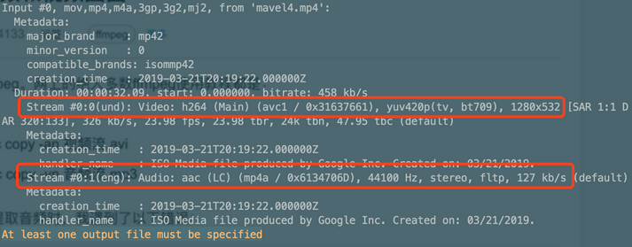
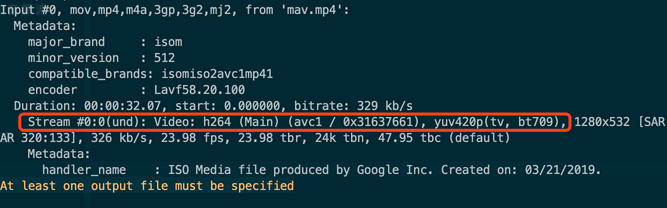
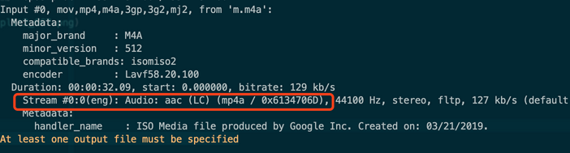

# ffmpeg-音频

## ffmpeg-音频格式转换

```sh
# 把mp3文件转换为wav文件
ffmpeg -i input.mp3 output.wav

# 把wav文件转换为mp3文件
ffmpeg -i input.wav -acodec libmp3lame -aq 4 -ar 44100 -ab 320k -ac 2 output.mp3

# 放大音量（volune=1表示正常音量,=0.5表示变为一半,=2表示变为2倍)
ffmpeg -i input.wav -c:a copy -af 'volume=2' output.wav
```

#### 参数说明

- 【-i 】后面跟需要处理的文件
- 【-acodec libmp3lame】 a是audio（音频）的缩写，codec是编码器的意思，所以acodec就是音频编码器。这里写的libmp3lame是mp3的编码器，也就是这里指定了使用mp3的编码器对该音频进行编码。当然如果不写这个也可以，ffmpeg会根据你的后缀自动匹配编解码器来进行转码
- 【-ar 44100】 ar（audio rate）是指定采样率的，这里我们指定为44100。如果我们自己不指定的话，ffmpeg默认使用的是原音频的采样率
- 【-ab 320k 】ab（audio byte）指定音频的比特率，这里指定320k。如果不输入的话ffmpeg默认是128k
- 【-ac 2】 ac（audio channels）指定音频的声道，1表示单声道，2表示双声道立体声，默认使用原音频的声道
- 【 -aframes 4 】设置音频的帧数
- 【-aq 4】audio quality设置音频质量
- 【-an 】禁用音频（其实就是把音频流剔除，可以理解为audio none）
- 【-vol 100】volume设置音量，默认是256，也就是100%音量，这里设置为100也就是将声音调小
- 【-af 'volume=2'】（audio filter）设置音频过滤器，这里将声音的值设为原来的二倍
- 【-c:a copy】这个其实也是指定编码器，-c:a copy是说采用acodec音频编码器进行copy操作（同-acodec copy），也就是复制原音频的编码

#### mp3 -> amr

```shell
ffmpeg -i a2_hrm_0.mp3 -ar 8000 -ac 1 a2_hrm_0.amr
```

- `-ar 8000`: amr采样率固定位8000
- `-ac 1`: amr是单声道的


## ffmpeg-音频分割

```shell
ffmpeg -i input.mp3 -ss hh:mm:ss -t hh:mm:ss -acodec copy output.mp3

ffmpeg -i input.mp3 -ss hh:mm:ss -to hh:mm:ss -acodec copy output.mp3
```

参数说明：   

- `ss` :  指定开始截取的时间点
- `t` :  持续时间
- `to`：指定截取到的时间点
- `acodec copy `: 编码格式和来源档桉相同

例子：

```shell
ffmpeg -i aa.mp3 -ss 00:01:12 -t 00:01:42 -acodec copy bb.mp3
```

## 获取音频信息

```shell
ffprobe -v quiet -show_format -show_streams -print_format json chu.mp3

{
    "streams": [
        {
            "index": 0,
            "codec_name": "mp3",
            "codec_long_name": "MP3 (MPEG audio layer 3)",
            "codec_type": "audio",
            "codec_tag_string": "[0][0][0][0]",
            "codec_tag": "0x0000",
            "sample_fmt": "fltp",
            "sample_rate": "44100",
            "channels": 2,
            "channel_layout": "stereo",
            "bits_per_sample": 0,
            "r_frame_rate": "0/0",
            "avg_frame_rate": "0/0",
            "time_base": "1/14112000",
            "start_pts": 353600,
            "start_time": "0.025057",
            "duration_ts": 9778544640,
            "duration": "692.924082",
            "bit_rate": "224000",
            "disposition": {
                "default": 0,
                "dub": 0,
                "original": 0,
                "comment": 0,
                "lyrics": 0,
                "karaoke": 0,
                "forced": 0,
                "hearing_impaired": 0,
                "visual_impaired": 0,
                "clean_effects": 0,
                "attached_pic": 0,
                "timed_thumbnails": 0
            },
            "tags": {
                "encoder": "Lavc58.54"
            }
        }
    ],
    "format": {
        "filename": "chu.mp3",
        "nb_streams": 1,
        "nb_programs": 0,
        "format_name": "mp3",
        "format_long_name": "MP2/3 (MPEG audio layer 2/3)",
        "start_time": "0.025057",
        "duration": "692.924082",
        "size": "19402889",
        "bit_rate": "224011",
        "probe_score": 51,
        "tags": {
            "major_brand": "M4A ",
            "minor_version": "0",
            "compatible_brands": "M4A isommp42",
            "encoder": "Lavf58.29.100",
            "title": "出G的SF",
            "voice-memo-uuid": "41B2A31F-A622-4480-88AE-CFFCC6512D6F",
            "creation_time": "2021-01-09T16:05:10.000000Z"
        }
    }

}
```


## 音频压缩

```shell
ffmpeg -i "PZONKA190313.wav" -b:a 64k -acodec mp3 -ar 44100 -ac 1 "1.mp3"
```

## ffmpeg分离视频流和音频流

##### 1 使用`ffmpeg -i`命令查看视频和音频格式信息

```shell
ffmpeg -i mavel4.mp4
```



执行该命令可以直接查看视频的信息，其中就有刚才的提到的**视频流（Video: h264）**和**音频流（Audio: aac）**

使用参数 `-vcodec copy -an` 和 `-acodec copy -vn` 可以分离出视频流和音频流。

##### 分离视频

```shell
ffmpeg -i mavel4.mp4 -vcodec copy -an mav.mp4
```

等待转码成功后，观看 `mav.mp4` 发现已经没有声音了，查看发现只有一个流



##### 分离音频

```shell
ffmpeg -i mavel4.mp4 -acodec copy -vn m.m4a
```

再次查看音频流信息



> ⚠️⚠️
> 
> 直接执行`ffmpeg -i mavel4.mp4  -acodec copy -vn m.mp3`有可能因为音频格式问题报错
> 
> 可以先转为`m4a` 再转为`mp3`
> 
> `ffmpeg -i m.m4a m.mp3`


