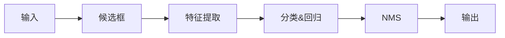

# 目标检测

## 物体检测业务场景

- **识别**、**检测**、**分割**
- SLAM（这个物体在这个真是世界当中的3D信息）
- 事件问答（这个场景正在发生什么，希望计算机能够根据图像或者视频，我们回答一些问题）

## 目标检测

**目标检测**：目标检测是在图片中对**可变数量**的目标进行查找和分类

````col
```col-md
- 目标种类和数量问题
- 目标尺寸问题
- 外在环境干扰问题
```

```col-md

```
````

````col
```col-md
**目标检测**


```

```col-md
**目标分割**


```
````

**目标检测方法发展史**


## Anchor based

算法基本流程



目标检测问题建模（理解Anchor概念）


````col
```col-md
**One stage**
- SSD系列
- YOLO系列
```

```col-md
**Two stage**
- FasterRCNN系列
- MaskRCNN系列
```
````


**Anchor-Based的问题**

- 目标和anchor box匹配只看两个框重叠的大小
- 对于Anchor box的大小也是人为定义的
- Anchor box数量太多带来大量的负样本

## Anchor Free

> - **Anchor Based**： Anchor 是目标检测中的一个重要概念，通常是人为设计的一组框，作为分类 (classification）和框回归  (bounding box regression) 的基准框
> - **Anchor Free**：通过每一个点进行匹配，无Anchor的过程

**如何对目标检测问题的真值，进行表示？**

- YOLO V1中的回归网络（中心点坐标、长和宽）
- 基于多关键点联合表达的方法
	- CornerNet. CenterNet. ExtremeNet、 RepPoints、FoveaBox、PLN
	- CenterNet: Keypoint Triplets for Object Detection
- 基于单中心点预测的方法
	- CenterNet: Objects as Points： 中心点＋宽度＋高度
	- CSP：中心点+高度
	- FCOS：中心点+到框的2个距离

## 评价指标

- TP：标注框重叠率很高
- FP：重叠率低（甚至没有重叠） 和重复检测的框
- precision 和recall
- AP和mAP

## 目标检测问题中的难点

- 小目标检测问题
- 遮挡目标检测问题
- 密集场景下的目标检测问题
- 倾斜、变形物体检测问题


