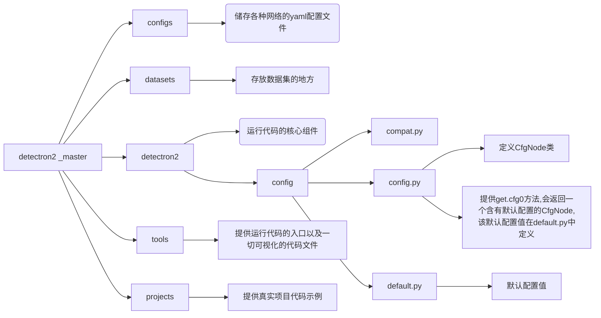
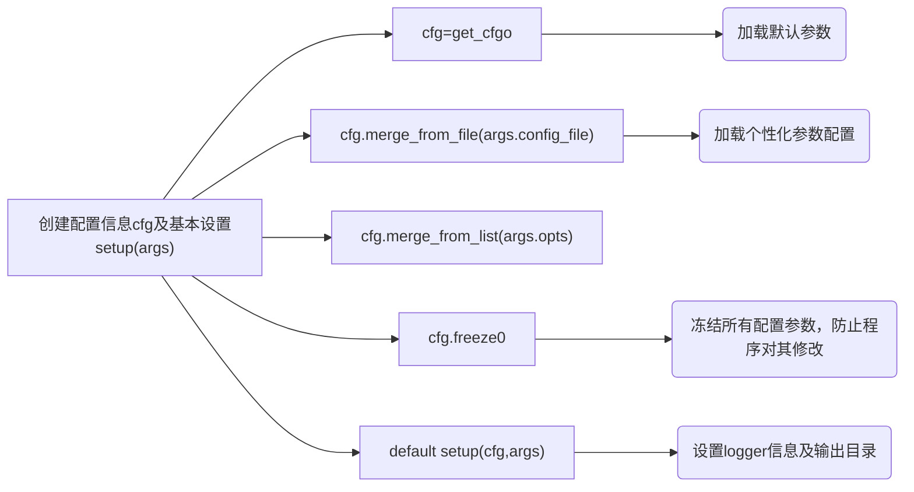

# [Detectron](https://github.com/facebookresearch/detectron2)

- 2018年初，Facebook AI研究院（FAIR）公开了一个目标（视觉）检测平台，名叫Detectron（目前已经是V2）。它是一个软件系统，由Python语言和Caffe2深度学习框架构建而成。
- Mask RCNN, RetinaNet, Faster RCNN, RPN,  
    Keypoints，Panoptic Segmentation等一系列优秀算法框架
- 支持数据集：COCO，PasscalVOC,Cityscapes,LVIS等不同数据集

## 结构介绍



## 配置

使用[yacs](https://github.com/facebookresearch/detectron2/blob/master/ configs/Base-RCNN-FPN.yaml)来定义配置文件内容



## 环境配置

## 训练 & 测试

```shell
./train_net.py --config-file /configs/COCO-InstanceSegmentation/mask_ronn_R_50_FPN_1x.yaml -num-gpus 1 SOLVER.IMS PER _BATCH 2 SOLVER.BASE_LR 0.0025

./train_net.py --config-file./configs/COCO-InstanceSegmentation/mask_ronn_R 50_FPN_1x.yaml --eval-only MODEL.WEIGHTS /path/to/checkpoint_file

./train_net.Dy -h
```

## 推理

```shell
python demo.py --config-file ../configs/cOCO-InstanceSegmentation/mask_renn_R_50_FPN_3x.yaml --input input1.jpg input2.jpg [--other-options] --opts MODEL.WEIGHTS detectron2://COCO-InstanceSegmentation/mask_ronn_R_50_FPN_3x/137849600/model_final_f10217.pkl
```


