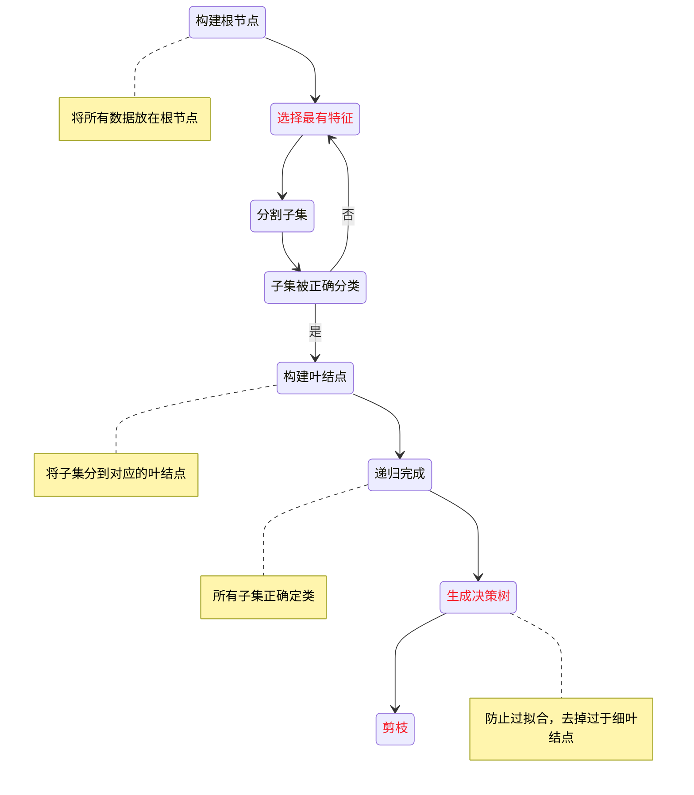

# 决策树

## 5.1 决策树模型与学习

### 5.1.1 决策树模型

**分类决策树模型**：是一种描述对实例进行分类的树形结构。 决策树由**结点** (node) 和**有向边** (directed edge )组成。结点有两种类型 : 

- **内部结点**( internal node )：表示一个特征或属性
- **叶结点** (leaf node) ：表示一个类 

### 5.1.2 决策树与 if-then 规则

可以将决策树看成 一 个 `if-then` 规则的集合。决策树的路径或其对应的 `if-then` 规则集合具有一个重要的性质：互斥并且完备。

### 5.1.3 决策恻与条件概率分布

决策树还表示给定特征条件下类的条件概率分布 。 这一条件概率分布定义在**特征空间的一个划分**(partition) 上。

### 5.1.4 决策树学习

- 决策树生成：局部选择，局部最优
- 决策树剪枝：全局选择。全局最优
- 算法有 ID3、 C4.5 与 CART

## 5.2 特征选择

### 5.2.1 特征选择问题

- 信息增益
- 信息增益比

### 5.2.2 信息增益

#### 熵(entropy)

> 熵是表示随机变量不确定性的度量。
> **熵越大，随机变量的不确定性就越大**。

设$X$是一个取有限个值的离散随机变量，其概率分布为

$$
P(X = x_i) = p_i, i=1,2,\dots,n
$$

则随机变量$X$的情定义为

$$
H(X) = -\sum_{i=1}^np_i\log p_i
$$

- $p_i = 0$定义$0log0=0$
- 式中对数以2为底——熵单位为**比特**(bit)
- 式中对数以e为底——熵单位为**纳特**(nat)

熵只依赖于$X$的分布，而与$X$的取值无关，所以也可将$X$的熵记作$H(p)$，即

$$
H(p) = -\sum_{i=1}^np_i\log p_i
$$

从定义可验证

$$
0 \le H(p) \le logn
$$

#### 条件熵(conditional entropy)

> **条件熵**$H(Y|X)$表示在己知随机变量$X$的条件下随机变量$Y$的不确定性。

随机变量$X$给定的条件下随机变量$Y$的条件熵$H(Y|X)$， 定义为$X$给 定条件下$Y$的条件概率分布的熵对$X$的数学期望

$$
H(Y|X) = \sum_{i=1}^np_iH(Y|X = x_i)
$$

这里 ，$p_i = P(X = x_i), i =1,2,\dots,n$

当熵和条件熵中的概率由数据估计(特别是极大似然估计)得到时，所对应的熵与条件熵分别称为**经验熵**和**经验条件熵**。此时，如果有0概率，令 $0log0 = 0$。

#### 信息增益(information gain)

> 信息增益表示得知特征 X 的信息而使得类 Y 的信息的不确定性减少的程度。

特征 A 对训练数据集 D 的信息增益 $g(D,A)$， 定义为集合 D 的经验熵$H(D)$ 与特征 A 给定条件下 D 的经验条件熵$H(D|A)$之差，即

$$
g(D,A) = H(D) - H(D|A)
$$

熵$H(Y)$与条件熵$H(Y|X)$之差称为**互信息** (mutual information) 。决策树学习中的信息增益等价于训练数据集中类与特征的互信息。

#### 信息增益的算法

设训练数据集为$D$， $|D|$表示其样本容量，即样本个数。

设有$K$个类$C_k, k=1,2,,\dots,K$，$|C_k|$为属于类$C_k$的样本个数，$\sum_{k=1}^K|C_k| = |D|$。

设特征$A$有$n$个不同的取值$\{a_1,a_2,\dots,a_n\}$，根据特征$A$的取值将$D$划分为$n$个子集$D_1,D_2,\dots,D_n$，$|D_i|$为$D_i$的样本个数，$\sum_{i=1}^n|D_i| = |D|$。

记子集$D_i$中属于类$|C_k|$的样本的集合为$D_ik$，即$D_ik = D_i \cap C_k$，$|D_ik|$为$D_ik$的样本个数。

输入：训练数据集 $D$ 和特征 $A$;

输出：特征 $A$ 对训练数据集 $D$ 的信息增益 $g(D,A)$。

信息增益的算法：

- （1）计算数据集 $D$ 的经验熵 $H(D)$

$$
H(D) = -\sum_{k=1}^K \frac{|C_k|}{|D|}log_2\frac{|C_k|}{|D|}
$$

- （2）计算特征 $A$ 对数据集 $D$ 的经验条件熵 $H(D|A)$

$$
H(D|A) = \sum_{i=1}^n \frac{|D_i|}{|D|}H(D_i) = -\sum_{i=1}^n \frac{|D_i|}{|D|}\sum_{k=1}^K\frac{|D_{ik}|}{|D_i|}log_2\frac{|D_{ik}|}{|D_i|}
$$

- （3）计算信息增益

$$
g(D,A) = H(D) - H(D|A)
$$

> 以信息增益作为划分训练数据集的特征，存在偏向于选择取值较多的特征的问题。

### 5.2.3 信息增益比

特征 $A$ 对训练数据集 $D$ 的信息增益比 $g_R(D, A)$ 定义 为其信息增益 $g(D, A)$ 与训练数据集 $D$ 关于特征 $A$ 的值的熵 $H_A(D)$ 之比，即

$$
g_R(D,A) = \frac{g(D,A)}{H_A(D)}
$$

其中，$H_A(D) = -\sum_{i=1}^n \frac{|D_i|}{|D|}log_2\frac{|D_i|}{|D|}$，n 是特征 $A$ 取值的个数。

## 5.3 决策树的生成

### 5.3.1 ID3 算法

输入：训练数据集$D$， 特征集$A$阔值$\varepsilon$

输出：决策树 $T$

- （1）若 $D$ 中所有实例属于同一类 $C_k$， 则 $T$ 为单结点树，并将类 $C_k$ 作为该结点的类标记，返回 $T$
- （2）若 $A = \varnothing$ 巨型，则 $T$ 为单结点树，并将 $D$ 中实例数最大的类 $C_k$ 作为该结点的类标记，返回 $T$
- （3）否则，按算法 5.1 计算 $A$ 中各特征对 $D$ 的信息增益，选择信息增益最大的特征 $A_g$
- （4）如果 $A_g$的信息增益小于阔值 $ε$，则置 $T$ 为单结点树，并将 $D$ 中实例数最大的类 $C_k$ 作为该结点的类标记，返回 $T$
- （5）否则，对$A_g$的每一可能值句，依$A_g =a_i$ 将 $D$ 分割为若干非空子集$D_i$ 将 $D_i$中实例数最大的类作为标记，构建子结点，由结点及其子结点构成树$T$， 返回$T$
- （6）对第$i$个子结点，以 $D_i$为训练集，以 $A - \{A_g\}$ 为特征集，递归地调用步 (1)~ 步 (5)，得到子树$T_i$，返回$T_i$ 。

> ID3 算法只有树的生成，所以该算法生成的树容易产生过拟合。

### 5.3.2 C4.5 的生成算法

输入：训练数据集$D$， 特征集$A$阔值$ε$

输出：决策树$T$。  

- （1）如果 $D$ 中所有实例属于同 一类 $C_k$， 则置 $T$ 为单结点树，并将 $C_k$ 作为该结点的类，返回 $T$;
- （2）如果 $A=\varnothing$ 正当，则置 $T$ 为单结点树，并将 $D$ 中实例数最大的类 $C_k$ 作为该结点 的类，返回 $T$;
- （3）否则，按式 (5.10) 计算 $A$ 中各特征对 $D$ 的信息增益比，选择信息增益比最大 的特征 $A_g$;
- （4）如果 $A_g$ 的信息增益比小于阔值 $ε$，则置 $T$ 为单结点树，并将 $D$ 中实例数最大的类 $C_k$ 作为该结点的类，返回 $T$;  
- （5）否则，对 $A_g$ 的每一可能值 $a_i$，依 $A_g=a_i$ 向将 $D$ 分割为子集若干非空 $D_i$，将$D_i$ 中实例数最大的类作为标记，构建子结点，由结点及其子结点构成树 $T$， 返回 $T$; 
- （6）对结点 $i$，以 $D_i$ 为训练集，以 $A - \{A_g\}$ 为特征集，递归地调用步（1）~步（5），得到子树$T_i$，返回$T_i$。

## 5.4 决策树的剪枝

在决策树学习中将己生成的树进行简化的过程称为剪枝 (pruning) 。具体地，剪枝从己生成的树上裁掉一些子树或叶结点 ， 并将其根结点或父结点作为新的叶结点，从而简化分类树模型。

设树 $T$ 的叶结点个数为 $|T|$， $t$ 是树 $T$ 的叶结点，该叶结点有$N_t$个样本点，其中$k$类的样本点有$N_{tk}$个， $k=1,2,\dots,K$，$H_t(T)$为叶结点$t$上的经验熵，$\alpha \ge 0$ 为参数，则决策树学习的损失函数可以定义为

$$
C_{\alpha} = \sum_{t=1}^{|T|}N_tH_t(T) + \alpha|T|
$$

其中经验熵为

$$
H_t(T) = -\sum_k\frac{N_{tk}}{N_t}log\frac{N_{tk}}{N_t}
$$

记

$$
C(T) = \sum_{t=1}^{|T|}N_tH_t(T) = -\sum_{t=1}^{|T|}\sum_{k=1}^KN_{tk}log\frac{N_{tk}}{N_t}
$$

这时有

$$
C_{\alpha}(T) = C(T) + \alpha|T|
$$

- $C(T)$表示模型对训练数据的预测误差
- $|T|$表示模型复杂度
- 参数 $α \ge O$ 控制两者之间的影响

#### 树的剪枝算法

输入：生成算法产生的整个树 $T$， 参数 $α$ 

输出：修剪后的子树$T_{\alpha}$。

- (1)计算每个结点的经验婿。  
- (2) 递归地从树的叶结点向上回缩。

设一组叶结点回缩到其父结点之前与之后的整体树分别为 $T_B$ 与 $T_A$， 其对应的损失函数值分别是 $C_{\alpha}(T_B)$ 与 $C_{\alpha}(T_A)$，如果

$$
C_{\alpha} \le C_{\alpha}(T_B)
$$

则进行剪枝，即将父结点变为新的叶结点。

- (3) 返回 (2)，直至不能继续为止，得到损失函数最小的子树$T_{\alpha}$。

## 5.5 CART算法

决策树的生成就是递归地构建二叉决策树的过程。对回归树用平方误差最小化准则，对分类树用基尼指数 (Gini index) 最小化准则，进行特征选择，生成二叉树。

### 1.回归树的生成

假设 $X$ 与 $Y$分别为输入和输出变量，并且 $Y$ 是连续变量，给定训练数据集

$$
D = \{(x_1,y_1),(x_1,y_1),\dots,(x_N,y_N)\}
$$

一棵回归树对应着输入空间(即特征空间)的一个划分以及在划分的单元上的输出值。 假设己将输入空间划分为 $M$ 个单元$R_1,R_2,\dots,R_M$， 并且在每个单元 $R_m$ 上 有一个固定的输出值$c_m$，于是回归树模型可表示为

$$
f(x) = \sum_{m=1}^Mc_mI(x \in R_m)
$$

可以用平方误差$\sum_{x_i \in R_m}(y_i - f(x_i))^2$来表示回归树对 于训练数据的预测误差，用平方误差最小的准则求解每个单元上的最优输出值。易知， 单元 $R_m$ 上的 $c_m$ 的最优值$\hat{c_m}$是$R_m$上的所有输入实例$x_i$对应的输出$y_i$的均值，即

$$
\hat{c_m} = ave(y_i|x_i \in R_m)
$$

选择第 $j$ 个变量 $x^{(j)}$和它取的值 $s$， 作为切分变量(splitting variable) 和切分点 (splitting point) ，并定义两个区域:

$$
R_1(j,s) = \{x|x^{(j)} \le s\} \text{和} R_2(j,s) = \{x|x^{(j)} > s\}
$$

然后寻找最优切分变量 $j$ 和最优切分点 $s$。具体地，求解

$$
\min_{j,s}[min_{c_1}\sum_{x_i \in R_1(j,s)}(y_i-c_1)^2+min_{c_2}\sum_{x_i \in R_2(j,s)}(y_i-c_2)^2]
$$

对固定输入变量 $j$ 可以找到最优切分点 $s$。

$$
\hat{c_1} = ave(y_i|x_i \in R_1(j,s)) \text{和} \hat{c_2} = ave(y_i|x_i \in R_2(j,s))
$$

遍历所有输入变量，找到最优的切分变量 $j$， 构成一个对$(j,s)$。回归树通常称为最小二乘回归树。

#### 最小二乘回归树生成算法

输入：训练数据集$D$  

输出：回归树$f(x)$。

在训练数据集所在的输入空间中 ， 递归地将每个区域划分为两个子区域并决定每个子区域上的输出值，构建二叉决策树 :

- （1）选择最优切分变量 $j$ 与切分点 $s$， 求解

$$
\min_{j,s}[min_{c_1}\sum_{x_i \in R_1(j,s)}(y_i-c_1)^2+min_{c_2}\sum_{x_i \in R_2(j,s)}(y_i-c_2)^2]
$$

遍历变量 $j$， 对固定的切分变量 $j$ 扫描切分点 $s$， 选择使式 (5.21) 达到最小值的对 $(j,s)$ 。

- （2）用选定的对 $(j,s)$ 划分区域并决定相应的输出值:

$$
R_1(j,s)=\{x|x^{(j)} \le s\}, R_2(j,s) = \{x|x^{(j)} > s\}
$$

$$
\hat{c}_m = \frac{1}{N_m}\sum_{x_i \in R_m(j,s)}y_i, x \in R_m, m = 1,2
$$

- （3）继续对两个子区域调用步骤 (1)， (2)，直至满足停止条件 。
- （4）将输入空间划分为 M 个区域$R_1,R_2,\dots,R_M$生成决策树:

$$
f(x) = \sum_{m=1}^M\hat{c}_mI(x \in R_m)
$$

### 2. 分类树的生成

分类树用基尼指数选择最优特征，同时决定该特征的最优二值切分点。

分类问题中，假设有 $K$ 个类，样本点属于第 $k$ 类的概率为$p_k$，则概率分布的基尼指数定义为

$$
Gini(p) = \sum_{k=1}^Kp_k(1-p_k)=1-\sum_{k=1}^Kp_k^2
$$

对于二类分类问题，若样本点属于第 1 个类的概率是 $p$ 则概率分布的基尼指数为

$$
Gini(D) = 2p(1-p)
$$

对于给定的样本集合 $D$， 其基尼指数为

$$
Gini(D) = 1 - \sum_{k=1}^K(\frac{|C_k|}{|D|})^2
$$

这里， $C_k$ 是 $D$ 中属于第 $k$ 类的样本子集， $K$ 是类的个数。

#### CART 生成算法

输入：训练数据集 $D$ ， 停止计算的条件:  

输出：CART决策树。

- （1）设结点的训练数据集为 $D$ ， 计算现有特征对该数据集的基尼指数。此时，对每一个特征 $A$， 对其可能取的每个值 $a$，根据样本点对 $A = a$ 的测试为"是"或"否" 将 $D$ 分割成 $D_1$ 和 $D_2$ 两部分，利用式 (5.25) 计算 $A = a$ 时的基尼指数。
- （2）在所有可能的特征 $A$ 以及它们所有可能的切分点 $a$ 中，选择基尼指数最小的特征及其对应的切分点作为最优特征与最优切分点。依最优特征与最优切分点，从现结点生成两个子结点，将训练数据集依特征分配到两个子结点中去。
- （3）对两个子结点递归地调用（1）（2），直至满足停止条件。  
- （4）生成 CART 决策树。

