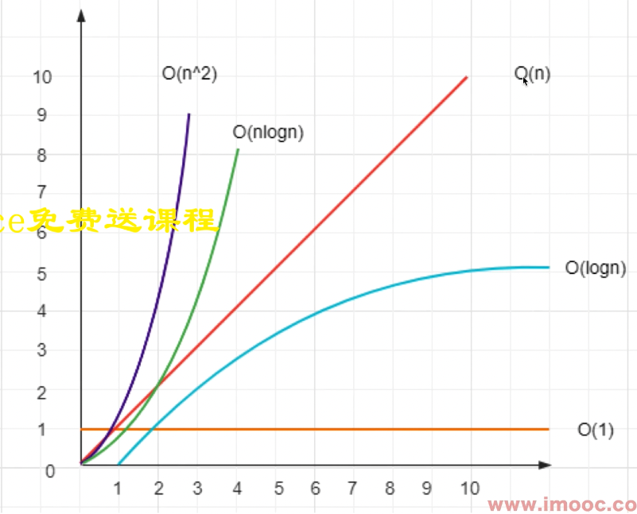
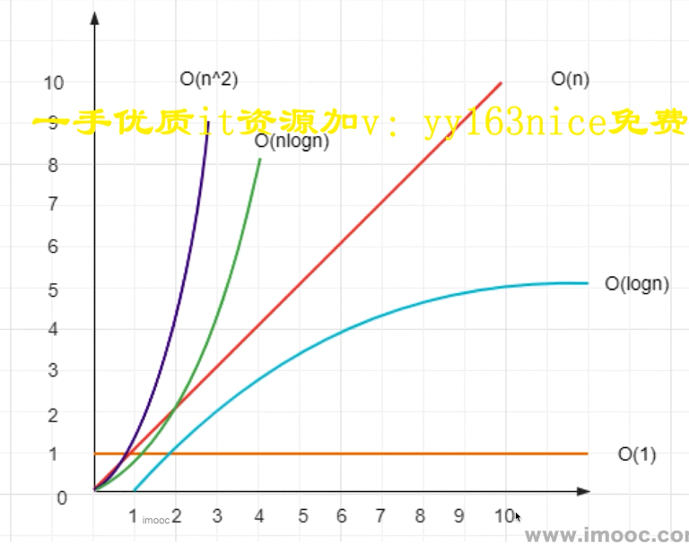
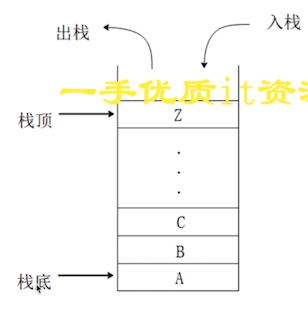

## 算法复杂度

### 什么是复杂度

- 程序执行时需要的计算量和内存空间（和代码是否简洁无关）
- 复杂度是**数量级**（方便记忆、推广），不是具体的数字
- 一般针对一个具体的算法，而非一个完成的系统

### 时间复杂度

程序执行时需要的计算量(CPU)



- $O(1)$一次就够（数量级）
- $O(n)$和传输的数据量一样（数量级）
- $O(n^2)$数据量的平方（数量级）
- $O(logn)$数据量的对数（数量级）
- $O(nlogn)$数据量*数据量的对数（数量级）

### 空间复杂度



## 题目

### 题目1 将一个数组旋转k步

> 将一个数组旋转k步，输入一个数组`[1,2,3,4,5,6,7]`，`k = 3`，即旋转3步，输出`[5,6,7,1,2,3,4]`

- 思路1：数组末尾元素`pop`出来，然后`unshift`进数组。时间复杂度$O(n^2)$，空间复杂度$O(1)$
- 思路2：数组拆分，再`concat`一起。时间复杂度$O(1)$，空间复杂度$O(n)$

思路1

```js
export function rotate1(arr: number[], k: number): number[] {
	const length = arr.length;
	if (!k || length === 0) return arr;
	const step = Math.abs(k % length);
	for (let i = 0; i < step; i++) {
		const n = arr.pop();
		if (n) {
			arr.unshift(n);
		}
	}
	return arr;
}
```

思路2

```js
export function rotate2(arr: number[], k: number): number[] {
	const length = arr.length;
	if (!k || length === 0) return arr;
	const step = Math.abs(k % length);
	const part1 = arr.slice(-step);
	const part2 = arr.slice(0, length - step);
	const part3 = part1.concat(part2);
	return part3;
}
```

### 题目2 判断字符串是否括号匹配

一个字符串`s`可能包含`{}()[]`三种括号，判断`s`是否是括号匹配的，如`(a{b}c)`匹配，而`{a(b`或`{a(b}c`就不匹配

#### 栈



**栈**与**数组**的关系：

- 栈：逻辑结构。理论模型，不管如何实现 ，不受任何语言的限制
- 数组，物理结构。真实的功能实现，受限于编程语言

```js
function isMatch(leftSymbol: string, rightSymbol: string) {
	if (leftSymbol === "(" && rightSymbol === ")") return true;
	if (leftSymbol === "[" && rightSymbol === "]") return true;
	if (leftSymbol === "{" && rightSymbol === "}") return true;
	return false;
}

export function marchBracket(str: string): boolean {
	const length = str.length;
	if (length === 0) return true;
	const stack: string[] = [];
	const leftSy = "({[";
	const rightSy = ")}]";
	for (let i = 0; i < length; i++) {
		const c = str[i];
		if (leftSy.includes(c)) {
			stack.push(c);
		} else if (rightSy.includes(c)) {
			const top = stack[stack.length - 1];
			if (isMatch(top, c)) {
				stack.pop();
			} else {
				return false;
			}
		}
	}
	return stack.length === 0;
}
```

算法分析：**时间复杂度**$O(n)$，**空间复杂度**$O(n)$

### 题目3 两个栈实现一个队列


### 题目2 快速排序

用JS实现快速排序，并说明时间复杂度


### 题目4 反转单向链表

输入一个单向链表，输出它的反转（头变尾，尾变头）


